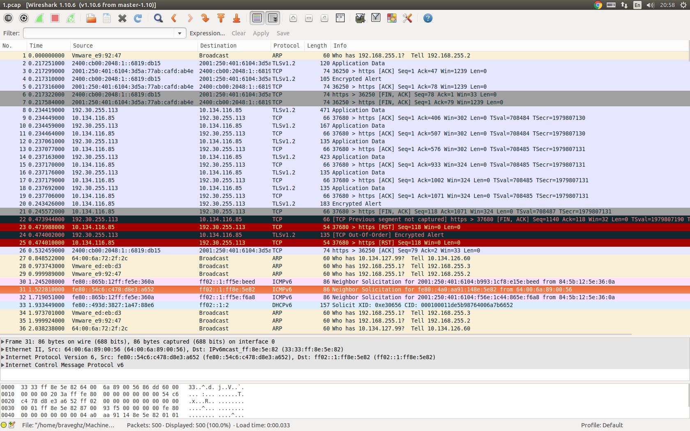
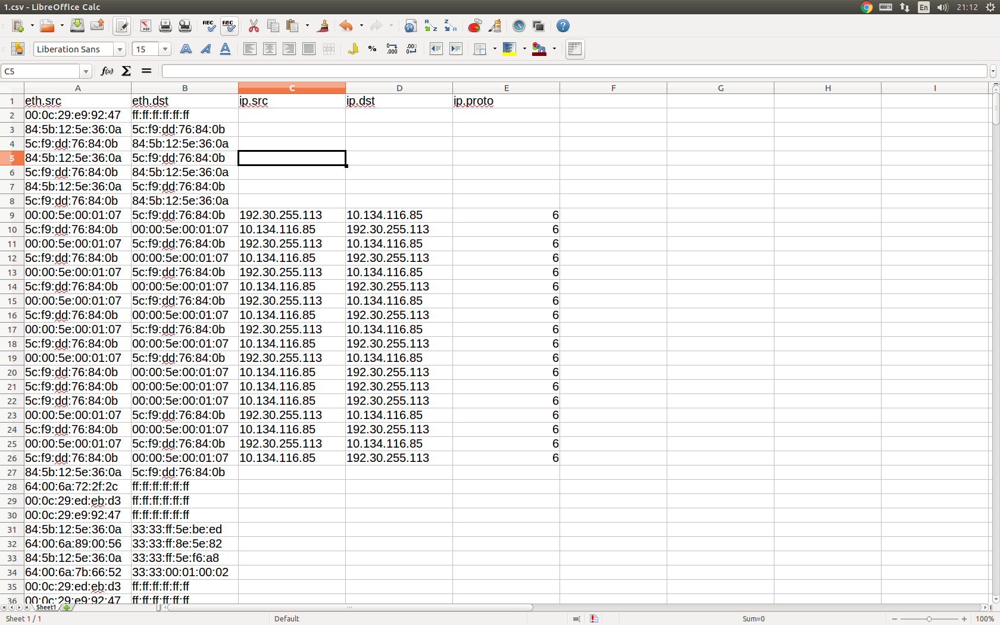

## 数据包解析

主要是 `.pcap` 解析为 `.csv`

### 安装libpcap

源代码 [网址](http://www.tcpdump.org/) 下载 `libpcap-x.x.x.tar.gz`
```s
braveghz@braveghz:~$ cd Downloads/
braveghz@braveghz:~/Downloads$ tar -zxvf libpcap-1.8.1.tar.gz 
braveghz@braveghz:~/Downloads$ cd libpcap-1.8.1/
braveghz@braveghz:~/Downloads/libpcap-1.8.1$ sudo apt-get install flex
braveghz@braveghz:~/Downloads/libpcap-1.8.1$ sudo apt-get install bison
braveghz@braveghz:~/Downloads/libpcap-1.8.1$ ./configure
braveghz@braveghz:~/Downloads/libpcap-1.8.1$ make 
braveghz@braveghz:~/Downloads/libpcap-1.8.1$ make install 
```

### 安装tshark
```s
braveghz@braveghz:~/Downloads/libpcap-1.8.1$ sudo apt-get install tshark
```

查看版本（检查是否安装成功喽
```s
braveghz@braveghz:~$ tshark -v
TShark 1.10.6 (v1.10.6 from master-1.10)
.......
```

运行`tshark -D`会提示`There are no interfaces on which a capture can be done`

then--解决办法：运行以下代码（其实我是瞎搞的
```s
$ sudo apt-get install wireshark
$ sudo dpkg-reconfigure wireshark-common 
$ sudo usermod -a -G wireshark $USER
$ gnome-session-quit --logout --no-prompt
```

结果ok
```s
braveghz@braveghz:~$ tshark -D
1. eth0
2. nflog
3. nfqueue
4. any
5. lo (Loopback)
```

### tshark使用

捕获500个网络数据包（`-c 500`）并保存到1.pcap（`-w 1.pcap`）：
```s
braveghz@braveghz:~/MachineLearning-python/nkamg-study$ tshark -c 500 -w 1.pcap
Capturing on 'eth0'
500 
```
用wireshark打开，长下面这样



可以看到信息：`no`/ `time`/ `source`/ `destination`/ `protocol`/ `length`/ `info`...实际上的pcap文件信息应该多得多

先转化为`csv`文件试一下,比如说我要提取数据包的`mac`/`ip`/`tcp/udp`等信息
```s
tshark -r 1.pcap -T fields -e eth.src -e eth.dst -e ip.src -e ip.dst -e ip.proto -E header=y -E separator=, -E quote=d -E occurrence=f >1.csv
```
ok



## 参考
[Using tshark to Watch and Inspect Network Traffic](http://www.linuxjournal.com/content/using-tshark-watch-and-inspect-network-traffic)
